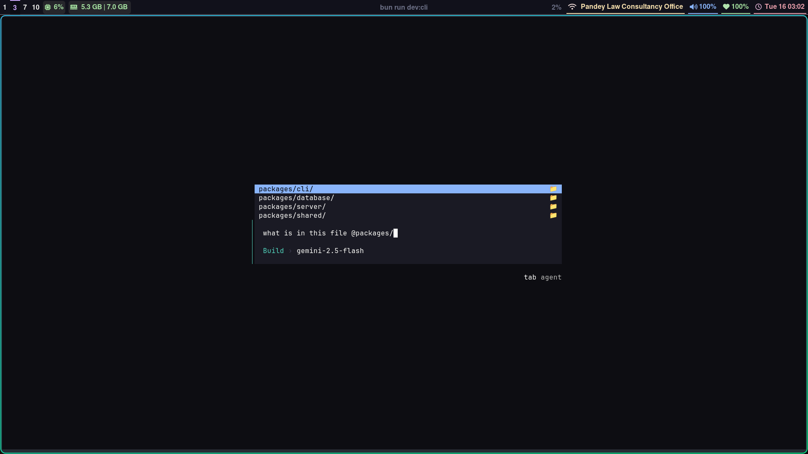
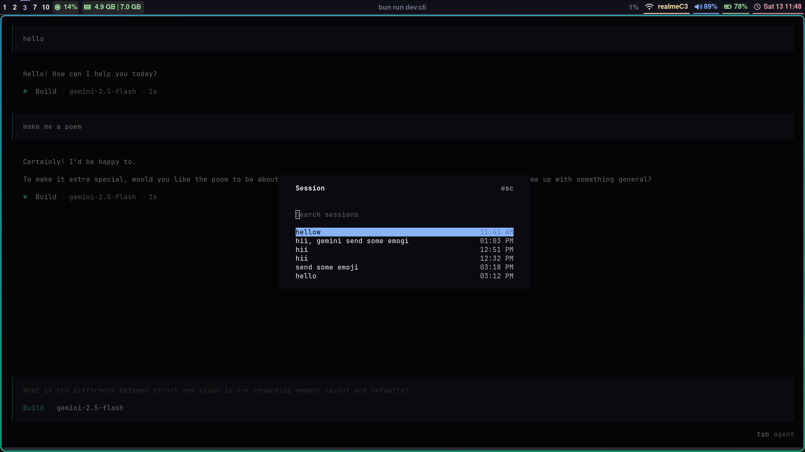
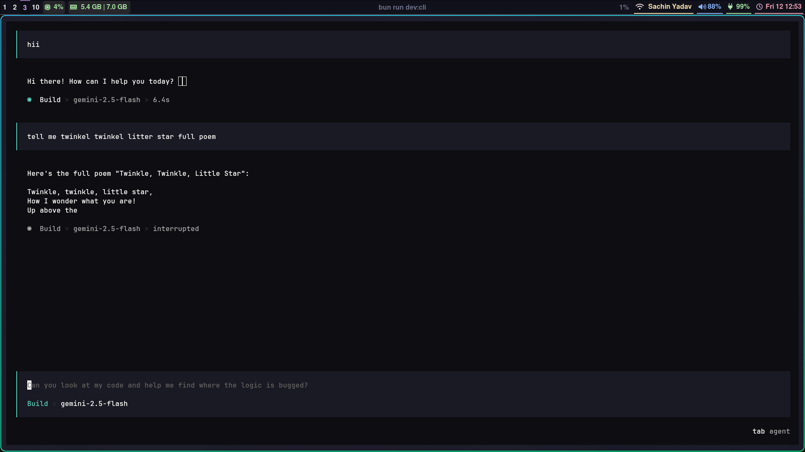
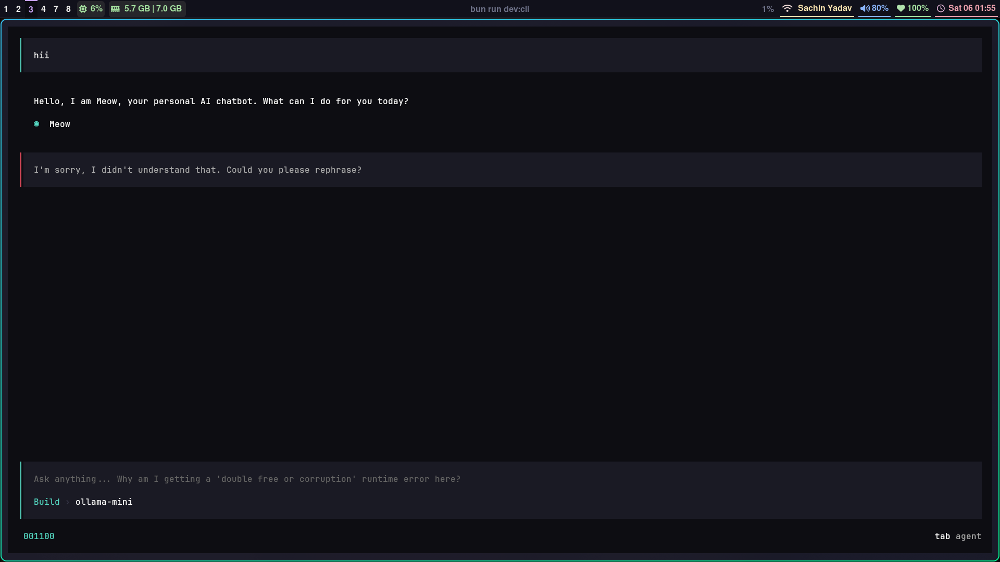
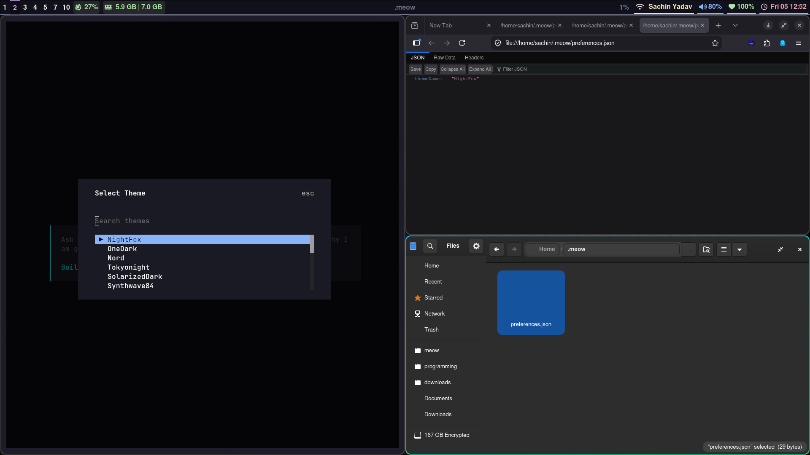
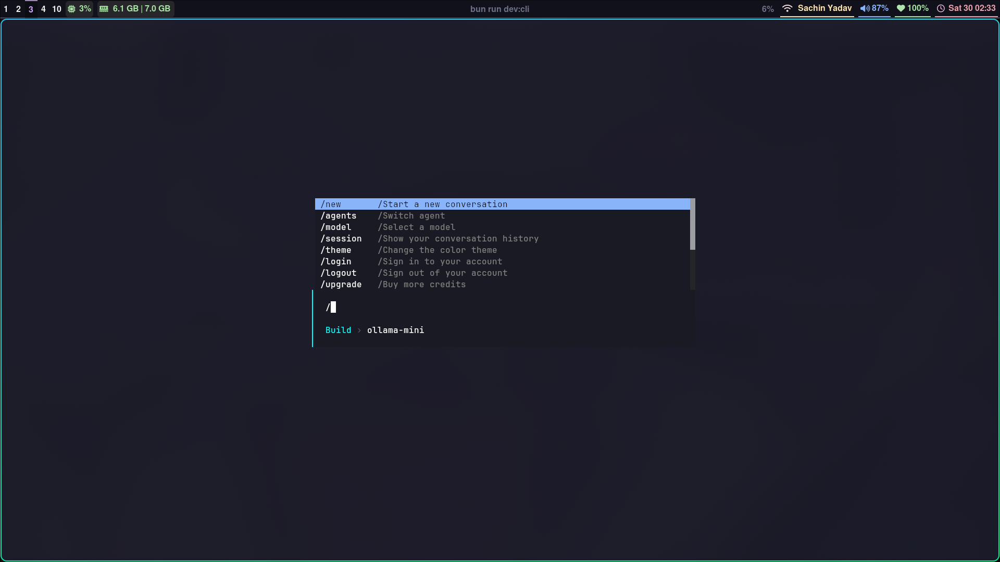
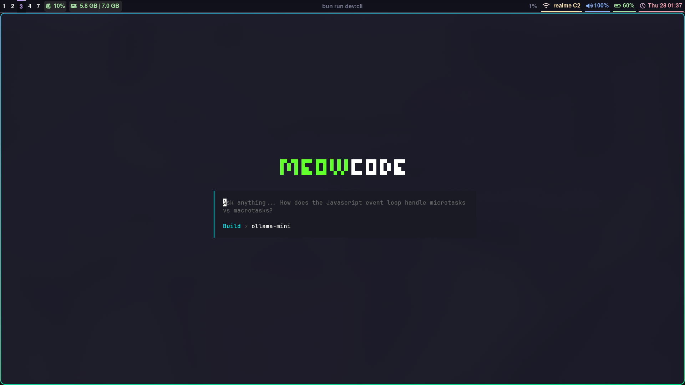

# Meow

timeline:


as of 16-6-2026 : @ file mention feature



as of 14-6-2026 : session resume




as of 12-6-2026 : AI chat with interrupt option



as of 6-6-2026 : UI for new chat session



as of 4-6-2026 : themes



as of 30-5-2026 : "/" menu for chat UI



as of 28-5-2026 : Basic setup and UI




--- 
Using bun for workspace
bun: [bun workspaces](https://bun.com/docs/pm/workspaces)
Using openTUI as a package for tui using react binding
OpenTUI: [openTUI](https://opentui.com/docs/bindings/react/) 

Run as -> go to packages/cli and run `bun run dev`
make it a script at root to do same
```json
  "scripts": {
    "dev:cli":"bun run --watch packages/cli/src/index.tsx"
  }
```
Hono is a express alternative

[used prisma for db](https://www.prisma.io/docs/prisma-orm/quickstart/prisma-postgres)

Vercel AI SDK
it is  a open source SDK for Vercel for provider => need stremaing => [stremaning](https://ai-sdk.dev/docs/foundations/streaming)
combine with hono streaming [hono streaming](https://hono.dev/docs/helpers/streaming)

